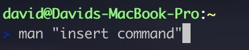

# team-cheat-sheet

`TAB`- help search file within the folder; easier to navigate 

``cd``-change directory

#### Note `TAB` key shows Available option

#### `TAB` to Highlight File

___

``ls``-list "Available Arguments : `a`|`l`|`al`"

>``a``-shows all files 

>``l``-shows file details

>``al``-shows all file details

___

``pwd``-print working directory 

___

``mkdir``-make directory "Available Arguments : `p`"

#### Extra Options *rmdir to remove folder

>``p``-create the complete path

___

``rm``-remove "Available Arguments : `rf`"

>``rf``-remove whole directory
___

``touch``-create a file .css .txt. doc etc 

___

``cp``-copy "Available Arguments : `r`"

>``r``-copy directory
___

``mv``-move or rename "Available Arguments : `f`

___

``..``-one folder up 

___

man **-manual/guide to the specific function

