# team-cheat-sheet

`TAB`- help search file within the folder; easier to navigate 

``cd``-change directory

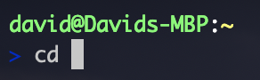
#### Note `TAB` key shows Available option

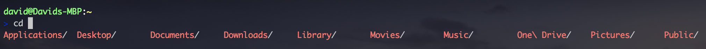
#### `TAB` to Highlight File

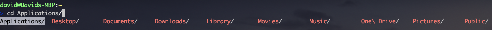

``ls``-list 

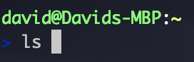
>``a``-shows all files 

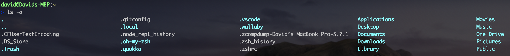

>``l``-shows file details

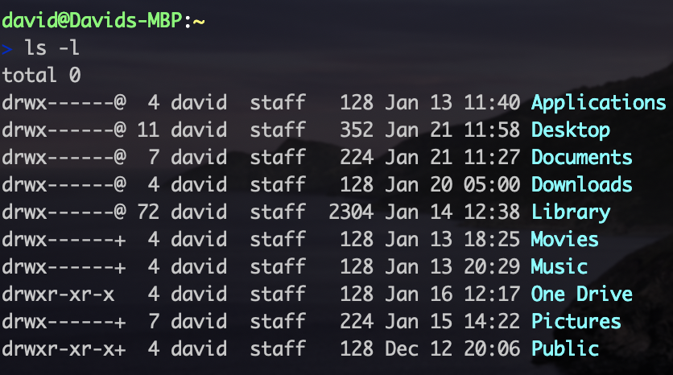

>``al``-shows all file details

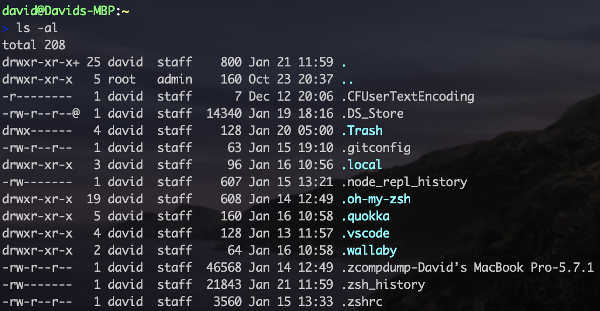

``pwd``-print working directory 

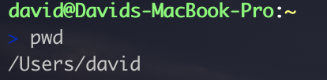

``mkdir``-make directory 

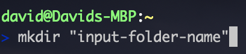

#### Extra Options *rmdir to remove folder

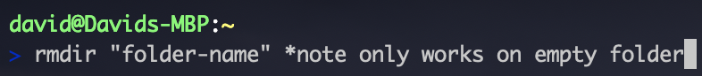

>``p``-create the complete path

``rm``-remove 

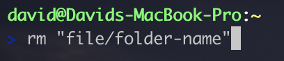

>``rf``-remove whole directory

``touch``-create a file .css .txt. doc etc 

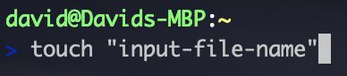

``cp``-copy 

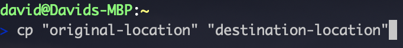
>``r``-copy directory

``mv``-move or rename 

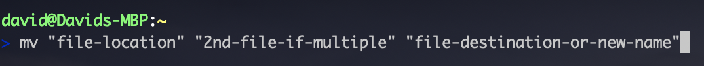

``..``-one folder up 

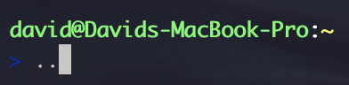

